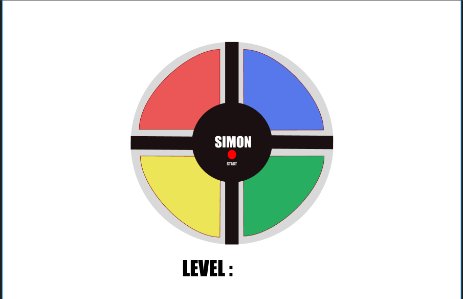

## Simon
Game of lights and sounds in which players must repeat random sequences of lights by pressing the colored pads in the correct order. It's fast-paced play, with lights and sounds that can challenge you. Experience the fun as you repeat the patterns and advance to higher levels.

## Technologies Used
- HTML
- CSS
- Javascript

## Getting Started
- Link to Play Game: https://romerorocj-ga.github.io/simon-project/

- Instructions
    - Get ready to watch, remember, repeat! 
    - Players must repeat random sequences of lights by pressing the colored panels in the correct sequence.
    - Fast-paced play, with lights and sounds that can challenge you.
    - Repeat the sequences and advance to higher levels until you reach the last one and win

- As a user
    - I want to be able to click all four colors
    - I want to be able to click the start button
    - I want to able to see what color I need to follow and select
    - I want to be able to win if I pass all ten levels
    - I want to know if I won
    - I want to be able to experince each level harder

## Screenshots of Final Game

## Pseudocode
-  Four different buttons, with a unique color and sound which is activated when pressed
- Round begins when the game activates one or more tiles in a random sequence and ends when the player reproduces the sequence by pressing the correct panels
- The game ends if the player misses a step in the sequence.

- State Variables
    - Game board is 1 big array that holds 4 smaller arrays for each color 
    - Moves
    - CompMoves
    - Winner - null until completing each level
    - The sequence is being generated randomly 
    - Level begins at 1

- Cache DOM ELments
    - Game Messages 
    - Start Game button
    - Start Game button shows up again after being wrong
    - Audio for each color

- Upon loading the app
    - Intialze all state variables
        - Create the array of 4 nested arrays
        - Turn variable should be set to 1 for Player One
        - Winner should be null
    - Render changes to the DOM
        - Render the board of the game
        - Render the four colors on each corner of circle
        - Do not render play again button until player selects wrong panel and Game Over message shows up 
    - Wait for player interaction
    
- Handle a player clicking the start button
    - The game starts by lighting up the first color and following colors for that next sequence

- Handle a player selecting the the colored buttons to follow the sequence
    - The player sees the sequence by each color lighting up when selected, they can then follow that sequece by 'clicking' what panel was lit up
    - The player should also hear audio everytime it lights up and once they click it
    - If the player gets the sequence right they move on to the next level, if wrong the level resets from the begining

- Check for Winner if beats all levels
    -  When the player wins, a congrats message will show up and the play again button.
    - If they lose the Try again message the play again button will show

## Design and Asthetics of the app
-  I want it be clean
-  I want it to have red, yellow, green and blue panels that light up
-  The game exists on a circle with panels in it the player will be selecting
-  Makes sounds each time it switches colors and each time its pressed

## Next Steps
- Include a power on button that makes the game functions turn on 
- Add an extra panel with another color to make it extra hard to follow the sequence
- Add more styling to the board

## Wireframe

